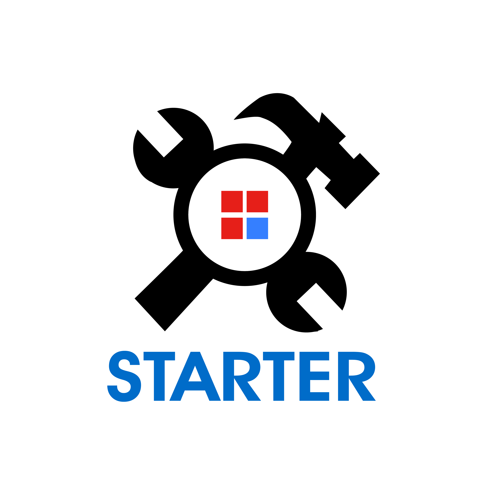

<p align="center">

</p>
<h3 align="center">STARTER - WEB开发集成架构 <a align="center" href="https://github.com/medivh-jay/starter/wiki/Step-1:%E4%B8%8B%E8%BD%BD%E6%9C%AC%E9%A1%B9%E7%9B%AE">wiki</a></h3>

- 本项目是一个整合了一些基础开发工具并稍微封装了一些日常操作的工具整合
- 可以使用它进行正常的开发而不必要去一个个重新装go库，重新组织结构
- 基本做到下载, 定义表, 定义控制器, 定义路由, 一键CURD, 做一个快乐的CURD boy
- 基本需求  mysql  和 mongo 是必须的, 可以使用 docker 安装
- 在使用时可按自己需要全盘修改所有内容,毕竟每个人的需求都不同
- 工具做了一些配置管理, configs 配置文件目录下氛围  debug, release 和 test , 分别对应 gin 的三个mode, 指定不同的mode将加载不同目录下的配置

#### 快速安装
```bash
go get github.com/medivh-jay/gocreator
gocreator -m 你预备的mod名
```

##### 提供基础CURD后端界面操作,wiki有模板使用说明


- 感谢 

- [LayUI](https://www.layui.com/)
- [X-admin](http://x.xuebingsi.com/)
- [gin](https://github.com/gin-gonic/gin)
- [BurntSushi/toml](https://github.com/BurntSushi/toml)
- [dgrijalva/jwt-go](https://github.com/dgrijalva/jwt-go)
- [jinzhu/gorm](https://github.com/jinzhu/gorm)
- [json-iterator](https://github.com/json-iterator/go)
- [sony/sonyflake](https://github.com/sony/sonyflake)
- [swaggo](https://github.com/swaggo)
- [mgo](https://gopkg.in/mgo.v2)
- [wangEditor](http://www.wangeditor.com/index.html)
- [mojocn/base64Captcha](github.com/mojocn/base64Captcha)
- [elogrus](https://github.com/sohlich/elogrus)
- [rifflock/lfshook](https://github.com/rifflock/lfshook)
