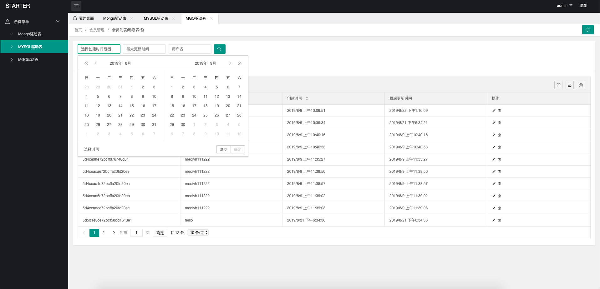

## STARTER  [wiki](https://github.com/medivh-jay/starter/wiki/%E5%A6%82%E4%BD%95%E4%BD%BF%E7%94%A8)

- 本项目作为启动器，整合了需要用到的常用三方库,并且封装了部分操作
- 在使用时可按自己需要全盘修改所有内容
- 在自己的启动文件中设置 gin.Mode 为 release 之后程序将读取 application.toml 而不是 development.toml
- 路由使用了gin
- 验证器使用了validator.v9
- orm使用了gorm
- mongo使用了mongo官方驱动
- 支持了mgo,自行选择使用的库, 分别是 mongo.Start() 和 mgo.Start(),同一张表结构只能被一个驱动操作,因为两个驱动某些属性不同可能混合操作会出现问题
- redis使用了go-redis
- elasticsearch 使用了 github.com/olivere/elastic/v7
- 使用了 gin 的session 中间件，使用redis存储
- 使用了github.com/dgrijalva/jwt-go作为json web token 验证器
- pkg/managers 包实现了 mongo和MySQL的curd操作，可提供后台管理api
- password 提供了 密码hash 和 密码验证
- 使用了 sony 唯一id生成工具作为MySQL默认主键id
- 使用了 toml 作为配置工具
- 使用 swagger 作为文档生成工具
- 使用了 facebook/gracehttp 作为优雅重启方案
- 提供了后端接口 CURD 操作, 权限模块, 启动权限模块会注入角色，权限等配置路由，
但是现在还不提供认证，需要手动编写代码,不过步骤不会太麻烦,只需要一个简单的中间件,
调用 permission.HasPermission 即可进行权限判断了, 如果使用了JWT等操作中间件来
传递用户信息,可能这个权限中间件要放到JWT中间件后边


- 编译之后在本项目根路径运行才能正确读取 configs 等各种静态资源
- Makefile 需要自己按需建立

### 使用方式
- 下载此项目的 zip 包， 然后将 go.mod 的moudle name 替换为自己定义的名字,然后将对应原来代码里边的 starter 全部替换为自己定义的名字即可
- 建议业务代码写到 internal 下边，按模块分类, 比如internal/admin 为管理相关代码,  internal/api 为接口相关代码(里边目前有两个默认的,只是示例,可以直接删除掉)
- 然后将 main.go 在 cmd 目录下建立对应的 admin 和 api 目录，分别在里边建立 main.go
- session中间件需要在调用 server.Run() 之前注入
- 如果要提供普通的增删改查操作, 可以查看 internal/manager/router.go 里边的示例,基本只需要建立好数据模型的结构体之后就能进行管理的CURD和基本查询操作了
```go
// 后端基础CURD操作
// 定义一个基础的结构体，可以是gorm的，也可以是mongo官方驱动的,也可以是mgo的
// 需要在tag里边指定 bson或者 gorm:"column:xxx", 因为一些验证会需要去读取
// 例如
// mongo 表, 示例
type Staff struct {
	Id        primitive.ObjectID `json:"_id" bson:"_id"`
	Username  string             `json:"username" bson:"username" form:"username" binding:"required,max=12"`
	Password  string             `json:"-" bson:"password" form:"password"`
	LoginAt   map[string]int64   `json:"login_at" bson:"login_at"`
	CreatedAt int64              `json:"created_at" bson:"created_at"`
	UpdatedAt int64              `json:"updated_at" bson:"updated_at"`
}

// mgo 驱动
type Mgo struct {
	Id        bson.ObjectId `json:"_id" bson:"_id"`
	Username  string        `json:"username" bson:"username" form:"username" binding:"required,max=12"`
	Password  string        `json:"-" bson:"password" form:"password"`
	CreatedAt int64         `json:"created_at" bson:"created_at"`
	UpdatedAt int64         `json:"updated_at" bson:"updated_at"`
}

// MySQL 示例
type Order struct {
	orm.Database
	ItemId string `json:"item_id" gorm:"column:item_id" form:"item_id" binding:"required"` // 订单id
	Total  int    `json:"total" gorm:"column:total" binding:"required,max=99"`             // 总数量
	Amount int    `json:"amount" gorm:"amount" binding:"required,min=100,max=1000000000"`  // 总金额
}

// 然后调用 managers ， 如下
managers.Register("/staff", "staffs", entities.Staff{}, managers.Mongo)
managers.Register("/mgo", "mgo", entities.Mgo{}, managers.Mgo)
// 参数一是路由, 参数二是表名，参数三是定义的结构体,参数4是使用驱动类型
// managers将会生成 GET POST PUT DELETE 四个方法，分别是查增改删
// 当然了，总会有一些需求与基本操作不一样,可以直接继承对应managers.XXX 
// 例如
type CustomOrder struct {
	managers.MysqlManager
}

// 可重新定义 List Post Delete Put 方法,就像这个方法一样
func (custom *CustomOrder) List(ctx *gin.Context) {
	log.Println("called this method")
	custom.MysqlManager.List(ctx)
}

// 然后调用此方法注入
managers.RegisterCustomManager(&controllers.CustomOrder{}, "/order", "orders", entities.Order{})

// 所有的表结构都注入直接,直接调用, engine 就是你自己的 gin 实例
managers.Start(engine)

// 然后就可以进行接口操作了, 比如
// GET http://localhost/staff/list 
// POST http://localhost/staff 
// DELETE http://localhost/staff?id=xxx mongo 全局使用 _id 
// PUT http://localhost/staff 表单自己组织

// list 接口还提供了筛选和区间查询操作
// 比如你的表存在 字段 name 和 age
// 你想查询 name=xxx 的数据, 组织如下
// http://localhost/staff/list?name=xxx
// 如果想查询 name=xxx并且age>=18的数据
// http://localhost/staff/list?name=xxx&section=age:18
// 如果想查询 name=xxx并且age在18到60之间的数据
// http://localhost/staff/list?name=xxx&section=age:18,60 两个数字程序会识别大小
// 如果想查询 age <= 60 的数据
// http://localhost/staff/list?section=-age:60
// 当然,有时候不一定只有一个字段参数这个范围查询
// 比如想要查询 age <= 60 并且 created_at <= 1565922677 并且 updated_at >= 1565912677
// http://localhost/staff/list?section=-age:60&section=-created_at:1565922677&updated_at:1565912677
```


- 正在考虑是否加入直接可用可快速开发的对后端友好的前后端分离的可单独使用的后台管理模板(已添加)
- 后端模板使用 x-admin 和 layUI 进行布局和动态操作
- 目前实现的是基本的增删改查操作, 代码在 web/admin/statc/js/admin.js 里边
- 登录和退出只是实现了跳转, 并没有写实际功能
- 运行 cmd/admin ，然后访问 /main 或者 /login 即可
- 为了有一个交互测试, 可以运行 cmd/manager ， 需要注意跨域问题和 JWT 验证, JWT 验证需要一个可解析数据表作为支持, 比如现在默认的 staffs

- 之后将准备将 managers 包中部分代码提出来, 单独实现数据分页工具
- 可能会将 MySQL 和 mongo 和 mgo 的表都提供 TableName 方法来获取表名, 而不是手写, 容易乱
- 可能准备实现一个简单的后台登录实际功能, 统一的后端文件上传功能, 权限管理的界面实现, 慢慢来
- 还有其他的.....



- 感谢 

- [LayUI](https://www.layui.com/)
- [X-admin](http://x.xuebingsi.com/)
- [gin](https://github.com/gin-gonic/gin)
- [BurntSushi/toml](https://github.com/BurntSushi/toml)
- [dgrijalva/jwt-go](https://github.com/dgrijalva/jwt-go)
- [jinzhu/gorm](https://github.com/jinzhu/gorm)
- [json-iterator](https://github.com/json-iterator/go)
- [sony/sonyflake](https://github.com/sony/sonyflake)
- [swaggo](https://github.com/swaggo)
- [mgo](https://gopkg.in/mgo.v2)
- [wangEditor](http://www.wangeditor.com/index.html)
